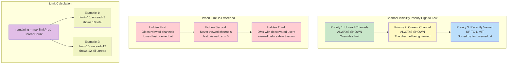
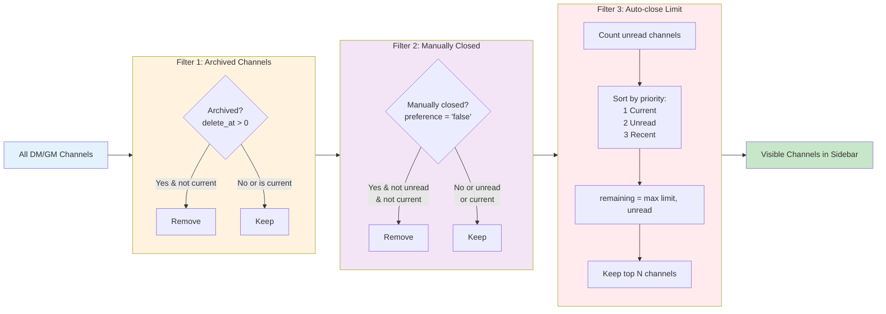

# Sidebar Channel/DM Display Logic Investigation

## Overview

This document provides a comprehensive explanation of the display logic for channels and direct messages (DMs) in the Mattermost sidebar, including how the system handles display limits and determines which channels/DMs to show or hide.

## Table of Contents

1. [Visual Flow Diagram](#visual-flow-diagram)
2. [Display Logic Components](#display-logic-components)
3. [Display Limit Configuration](#display-limit-configuration)
4. [Filtering and Sorting Rules](#filtering-and-sorting-rules)
5. [Deletion/Hide Priority](#deletionhide-priority)
6. [PC and Mobile Synchronization](#pc-and-mobile-synchronization)
7. [Technical Implementation](#technical-implementation)

## Visual Flow Diagram

The following Mermaid diagram illustrates the complete flow of the sidebar DM/GM display logic:

```mermaid
flowchart TD
    Start([Start: Render Sidebar DMs/GMs]) --> CheckCategory{Is category<br/>DIRECT_MESSAGES?}
    
    CheckCategory -->|No| ReturnAll[Return all channels<br/>unchanged]
    CheckCategory -->|Yes| LoadPrefs[Load user preferences<br/>and channel data]
    
    LoadPrefs --> Filter1[Filter 1:<br/>Archived Channels]
    Filter1 --> Filter1Check{Is channel archived<br/>delete_at > 0?}
    Filter1Check -->|Yes, and not current| Remove1[Remove from list]
    Filter1Check -->|No or is current| Keep1[Keep in list]
    Remove1 --> Filter2
    Keep1 --> Filter2
    
    Filter2[Filter 2:<br/>Manually Closed DMs] --> Filter2Check{User manually closed?<br/>preference = 'false'}
    Filter2Check -->|Yes, and not unread<br/>and not current| Remove2[Remove from list]
    Filter2Check -->|No or is unread<br/>or is current| Keep2[Keep in list]
    Remove2 --> Filter3
    Keep2 --> Filter3
    
    Filter3[Filter 3:<br/>Auto-close DMs] --> CountUnread[Count unread channels<br/>unreadCount = 0]
    
    CountUnread --> FilterLoop{For each<br/>channel}
    
    FilterLoop --> CheckUnread{Is channel<br/>unread?}
    CheckUnread -->|Yes| IncUnread[unreadCount++<br/>Keep channel]
    CheckUnread -->|No| CheckCurrent{Is current<br/>channel?}
    
    CheckCurrent -->|Yes| KeepCurrent[Keep channel]
    CheckCurrent -->|No| CheckDeactivated{DM with<br/>deactivated user?}
    
    CheckDeactivated -->|Yes, viewed before<br/>deactivation| RemoveDeactivated[Remove channel]
    CheckDeactivated -->|No or viewed after<br/>deactivation| KeepActive[Keep channel]
    
    IncUnread --> NextChannel
    KeepCurrent --> NextChannel
    RemoveDeactivated --> NextChannel
    KeepActive --> NextChannel
    
    NextChannel{More<br/>channels?}
    NextChannel -->|Yes| FilterLoop
    NextChannel -->|No| SortChannels
    
    SortChannels[Sort visible channels<br/>by priority] --> SortStep1{Priority 1:<br/>Current channel?}
    SortStep1 -->|channelA is current| AFirst[A comes first]
    SortStep1 -->|channelB is current| BFirst[B comes first]
    SortStep1 -->|Neither| SortStep2
    
    AFirst --> Continue
    BFirst --> Continue
    
    SortStep2{Priority 2:<br/>Unread status} --> CheckUnreadSort{Different<br/>unread status?}
    CheckUnreadSort -->|A unread, B read| AFirst2[A comes first]
    CheckUnreadSort -->|B unread, A read| BFirst2[B comes first]
    CheckUnreadSort -->|Same status| SortStep3
    
    AFirst2 --> Continue
    BFirst2 --> Continue
    
    SortStep3{Priority 3:<br/>Last viewed time} --> CompareTime{Compare<br/>last_viewed_at}
    CompareTime -->|A > B| AFirst3[A comes first<br/>most recent first]
    CompareTime -->|B > A| BFirst3[B comes first<br/>most recent first]
    CompareTime -->|Equal| Equal[Keep original order]
    
    AFirst3 --> Continue
    BFirst3 --> Continue
    Equal --> Continue
    
    Continue[Continue sorting] --> CalcLimit[Calculate limit:<br/>remaining = max limitPref, unreadCount]
    
    CalcLimit --> ApplyLimit[Slice array:<br/>visibleChannels = visibleChannels.slice 0, remaining]
    
    ApplyLimit --> Explanation{Example:<br/>limit=10, unread=12}
    Explanation -->|Shows| ShowAll[All 12 unread channels<br/>limit overridden]
    
    ShowAll --> FilterOriginal[Filter original array<br/>to maintain order]
    FilterOriginal --> ReturnFiltered[Return filtered channels]
    
    ReturnAll --> End([End])
    ReturnFiltered --> End
    
    style Start fill:#e1f5e1
    style End fill:#ffe1e1
    style Filter1 fill:#e3f2fd
    style Filter2 fill:#e3f2fd
    style Filter3 fill:#e3f2fd
    style CountUnread fill:#fff3e0
    style SortChannels fill:#f3e5f5
    style CalcLimit fill:#ffebee
    style ApplyLimit fill:#ffebee
    style Explanation fill:#fff9c4
```



### Diagram Legend

- **Green boxes**: Start/End points
- **Blue boxes**: Filter stages (3-tier filtering)
- **Orange boxes**: Unread counting logic
- **Purple boxes**: Sorting logic
- **Red boxes**: Limit calculation and application
- **Yellow boxes**: Example/explanation
- **Diamond shapes**: Decision points

### Key Algorithm Steps

1. **Three-Tier Filtering**
   - Filter 1: Remove archived channels (except current)
   - Filter 2: Remove manually closed DMs (except unread/current)
   - Filter 3: Apply auto-close logic with priority handling

2. **Priority-Based Sorting**
   - Priority 1: Current channel always first
   - Priority 2: Unread channels before read channels
   - Priority 3: Most recently viewed first (descending `last_viewed_at`)

3. **Limit Application**
   - Formula: `remaining = Math.max(limitPref, unreadCount)`
   - Ensures unread channels always visible
   - Oldest viewed channels hidden first when limit exceeded

## Display Logic Components

### Key Files

- **Frontend (WebApp)**:
  - `webapp/channels/src/packages/mattermost-redux/src/selectors/entities/channel_categories.ts` - Core display logic
  - `webapp/channels/src/components/user_settings/sidebar/limit_visible_gms_dms/limit_visible_gms_dms.tsx` - UI settings component
  - `webapp/channels/src/packages/mattermost-redux/src/constants/preferences.ts` - Preference constants

- **Backend (Server)**:
  - `server/public/model/preference.go` - Preference model and validation
  - `server/channels/store/sqlstore/preference_store.go` - Preference storage

### Channel Categories

The sidebar organizes channels into categories:
- **Favorites** - User-marked favorite channels
- **Channels** - Regular team channels (public and private)
- **Direct Messages** - Direct messages and group messages (DMs/GMs)
- **Custom Categories** - User-created custom categories

## Display Limit Configuration

### Available Limits

Users can configure the maximum number of DMs/GMs to display in the sidebar through user settings:

- **Options**: 10, 15, 20, or 40 channels
- **Default**: 20 channels
- **Preference Key**: `LIMIT_VISIBLE_DMS_GMS` in category `sidebar_settings`
- **Storage**: User preference stored in the database

### Valid Range

- **Minimum**: 1 channel
- **Maximum**: 40 channels (defined as `PreferenceMaxLimitVisibleDmsGmsValue`)
- **Validation**: Server validates preference values and rejects invalid limits
- **Cleanup**: Invalid preferences (outside 1-40 range) are periodically cleaned up

### Configuration Location

Users can set this limit in two places:
1. **User Settings** → **Sidebar** → "Number of direct messages to show"
2. **Direct Messages sidebar menu** (quick access)

## Filtering and Sorting Rules

### Visual Priority Hierarchy



### Primary Filters

The sidebar applies multiple layers of filtering before displaying channels:



#### 1. Archived Channel Filter (`makeFilterArchivedChannels`)

- **Filters out**: Archived/deleted channels (where `delete_at > 0`)
- **Exception**: Current channel is always visible, even if archived
- **Purpose**: Prevents showing channels that have been deleted or archived

#### 2. Manually Closed DM Filter (`makeFilterManuallyClosedDMs`)

- **Applies to**: Direct messages and group messages only
- **Filters based on**: User preferences in categories:
  - `direct_channel_show` (for DMs)
  - `group_channel_show` (for GMs)
- **Exceptions**:
  - Unread DMs/GMs are always visible
  - Current channel is always visible
- **Purpose**: Respects user's explicit choice to hide specific conversations

#### 3. Auto-closed DM Filter (`makeFilterAutoclosedDMs`)

This is the primary filter that enforces the display limit for DMs/GMs.

**Priority Hierarchy** (in order):

1. **Unread Channels** - Always shown regardless of limit
   - Channels with unread messages
   - Channels with mentions
   - Counted separately to ensure user never misses messages

2. **Current Channel** - Always shown
   - The channel currently being viewed
   - Ensures user context is maintained

3. **Active DMs with Live Users**
   - Filters out DMs where the other user has been deactivated
   - Exception: Shows if the DM was viewed after user deactivation

4. **Recently Viewed Channels** - Fills remaining slots
   - Sorted by last viewed timestamp
   - Uses the maximum of:
     - `last_viewed_at` from channel membership
     - `channel_approximate_view_time` preference
     - `channel_open_time` preference

### Sorting Order

After filtering, channels are sorted using the following priority:

#### For Auto-closed DMs (within the limit):

1. **Current Channel** - Always first
2. **Unread Channels** - Second priority (maintains unread order)
3. **Most Recently Viewed** - Last viewed timestamp (descending)
   - Most recent conversations appear first
   - Helps users quickly access recent conversations

#### For Regular Channels (by category setting):

Categories can use different sorting methods:

1. **Alphabetical Sorting** (`CategorySorting.Alphabetical` or `CategorySorting.Default`)
   - Regular channels: Sorted by `display_name`
   - DM channels: Sorted by teammate's display name
   - GM channels: Sorted by concatenated user display names
   - **Special rule**: Muted channels always appear last

2. **Recency Sorting** (`CategorySorting.Recency`)
   - Sorted by `last_post_at` (when Collapsed Reply Threads is off)
   - Sorted by `last_root_post_at` (when Collapsed Reply Threads is on)
   - Falls back to `create_at` if no posts exist

## Deletion/Hide Priority

### When the Limit is Exceeded

When more DMs/GMs exist than the configured limit, the system follows this order to determine which channels to hide:

#### Channels That Are NEVER Hidden:

1. **Unread channels** - Any channel with unread messages or mentions
2. **Current channel** - The channel being actively viewed

#### Channels Hidden First (Lowest Priority):

The system calculates:
```javascript
remaining = Math.max(limitPref, unreadCount)
```

This means:
- If you have 5 unread channels but limit is set to 3, you'll see 5 channels (all unreads)
- If you have 2 unread channels and limit is set to 10, you'll see 10 channels total

**Priority for hiding** (from first to hide):

1. **Oldest viewed channels** - Channels with the oldest `last_viewed_at` timestamp
2. **Never viewed channels** - Channels with `last_viewed_at = 0`
3. **DMs with deactivated users** - Where user was deactivated before last view

#### Example Scenarios:

**Scenario 1**: User has limit = 10, 3 unread DMs, 15 total DMs
- Shows: 3 unread + current + 6 most recent = 10 channels
- Hides: 5 oldest viewed DMs

**Scenario 2**: User has limit = 10, 12 unread DMs
- Shows: All 12 unread channels (limit is overridden)
- Hides: None (unread count takes precedence)

**Scenario 3**: User opens a hidden DM
- Shows: Current DM + limit-1 most recent
- May hide: The oldest DM that was previously visible

## PC and Mobile Synchronization

### Synchronization Mechanism

The sidebar display logic is synchronized between PC and mobile through:

1. **Preference Storage** - All settings stored in user preferences database
2. **Real-time Updates** - WebSocket events propagate preference changes
3. **Consistent Logic** - Same filtering/sorting algorithms on all platforms

### Data Synchronized:

- `LIMIT_VISIBLE_DMS_GMS` preference (display limit setting)
- `direct_channel_show` preferences (manually hidden/shown DMs)
- `group_channel_show` preferences (manually hidden/shown GMs)
- Channel membership data (`last_viewed_at`, `msg_count`, etc.)
- Message counts and unread status

### Platform Differences

While the core logic is identical, minor differences can occur:

1. **Timing Differences**
   - Mobile apps may have delayed WebSocket connections
   - Preference updates may arrive at slightly different times
   - Network conditions affect synchronization speed

2. **Display Rendering**
   - Mobile UI may show fewer channels due to screen size
   - Scrolling behavior differs between platforms
   - Mobile may use different category collapse states

3. **Local Caching**
   - Mobile apps cache more aggressively for offline support
   - May show stale data briefly until sync completes

### Known Discrepancies

Minor discrepancies observed in the DM section can occur due to:

1. **Race Conditions**
   - Preference update arrives before/after channel update
   - Multiple tabs/devices updating simultaneously

2. **Preference Migration**
   - Old preference format (`channel_approximate_view_time`, `channel_open_time`)
   - New format (`last_viewed_at` in channel membership)
   - System uses maximum of all three for compatibility

3. **Deactivated Users**
   - Timing of user deactivation event vs. DM visibility update
   - Different handling of deactivated user profiles on platforms

## Technical Implementation

### Core Functions

#### `makeFilterAutoclosedDMs()`

Located in: `webapp/channels/src/packages/mattermost-redux/src/selectors/entities/channel_categories.ts`

This is the primary function that implements the auto-close logic:

```typescript
export function makeFilterAutoclosedDMs(): 
    (state: GlobalState, channels: Channel[], categoryType: string) => Channel[]
```

**Algorithm**:
1. Skip if not DIRECT_MESSAGES category
2. Filter channels to find visible ones:
   - Keep all unread channels (count them)
   - Keep current channel
   - Filter out DMs with deactivated users (with exceptions)
3. Sort visible channels by priority:
   - Current channel first
   - Unread channels next
   - Then by `last_viewed_at` (descending)
4. Calculate limit: `Math.max(limitPref, unreadCount)`
5. Slice array to keep only top N channels
6. Return filtered list

#### `makeFilterManuallyClosedDMs()`

Filters channels based on explicit user preferences:

```typescript
export function makeFilterManuallyClosedDMs(): 
    (state: GlobalState, channels: Channel[]) => Channel[]
```

**Algorithm**:
1. For each DM/GM, check preference value
2. If preference is 'false', filter out (unless unread or current)
3. Return filtered list

#### `getVisibleDmGmLimit()`

Located in: `webapp/channels/src/packages/mattermost-redux/src/selectors/entities/preferences.ts`

Retrieves the user's configured limit:
- Reads from `sidebar_settings.limit_visible_dms_gms` preference
- Default value: 20
- Returns integer value

### State Management

The display logic relies on several pieces of state:

1. **Channel State**:
   - `channels.channels` - All channel objects
   - `channels.myMembers` - User's membership data (includes `last_viewed_at`)
   - `channels.messageCounts` - Unread message counts
   - `channels.currentChannelId` - Active channel

2. **Preference State**:
   - `preferences.myPreferences` - All user preferences
   - Key preference: `sidebar_settings.limit_visible_dms_gms`

3. **User State**:
   - `users.currentUserId` - Current user ID
   - `users.profiles` - User profile data (for deactivation status)

### Database Schema

**Preferences Table**:
```sql
CREATE TABLE Preferences (
    UserId   VARCHAR(26) NOT NULL,
    Category VARCHAR(32) NOT NULL,
    Name     VARCHAR(32) NOT NULL,
    Value    VARCHAR(2000),
    PRIMARY KEY (UserId, Category, Name)
);
```

**Relevant Preference Rows**:
- Category: `sidebar_settings`, Name: `limit_visible_dms_gms`, Value: `"10"|"15"|"20"|"40"`
- Category: `direct_channel_show`, Name: `{user_id}`, Value: `"true"|"false"`
- Category: `group_channel_show`, Name: `{channel_id}`, Value: `"true"|"false"`

## Testing

### Test Coverage

Comprehensive tests exist in:
- `webapp/channels/src/packages/mattermost-redux/src/selectors/entities/channel_categories.test.ts`

**Test Scenarios**:
1. Unread channels are always shown
2. Current channel is always shown
3. Exact number of channels specified by limit
4. Sorting by last viewed time
5. Handling approximate view time preferences
6. Deactivated user filtering
7. Manual close/open preferences

### Key Test Cases

1. **Limit Enforcement**: Verifies exactly N channels shown when limit = N
2. **Unread Override**: Verifies unread count overrides limit
3. **Priority Order**: Verifies current > unread > recent ordering
4. **Legacy Preferences**: Verifies compatibility with old preference keys

## Troubleshooting

### Common Issues

1. **DM not appearing despite being recent**
   - Check if limit is too low
   - Verify DM is not manually closed
   - Check if other user is deactivated

2. **Too many DMs showing**
   - Likely caused by many unread DMs (overrides limit)
   - Check unread message count

3. **Inconsistent display between devices**
   - Wait for preference sync (usually < 1 second)
   - Check WebSocket connection status
   - Verify both devices are logged in as same user

4. **DM with deactivated user showing/hiding unexpectedly**
   - Check `last_viewed_at` timestamp vs. user's `delete_at` timestamp
   - DM shows only if viewed after user deactivation

## Future Improvements

Potential areas for enhancement:

1. **Smarter Auto-close Logic**
   - Consider message recency, not just view time
   - Factor in message importance/priority
   - Learn from user interaction patterns

2. **Better Visual Indicators**
   - Show users why a DM was auto-closed
   - Provide quick access to hidden DMs
   - Visual cue for limit being reached

3. **Granular Controls**
   - Separate limits for DMs vs. GMs
   - Pin important conversations
   - Custom rules per DM/GM

4. **Improved Synchronization**
   - Reduce sync delays between platforms
   - Better handling of race conditions
   - Conflict resolution for simultaneous edits

## References

- [User Preferences Model](../server/public/model/preference.go)
- [Channel Categories Selector](../webapp/channels/src/packages/mattermost-redux/src/selectors/entities/channel_categories.ts)
- [Limit Settings Component](../webapp/channels/src/components/user_settings/sidebar/limit_visible_gms_dms/limit_visible_gms_dms.tsx)

## Conclusion

The Mattermost sidebar display logic implements a sophisticated system for managing channel visibility:
- **Priority-based**: Ensures important channels (unread, current) are always visible
- **User-controlled**: Respects user preferences for limits and manual hiding
- **Synchronized**: Maintains consistency across devices through preference storage
- **Tested**: Comprehensive test coverage ensures reliability

The system balances user control with automatic management to provide an optimal experience while preventing information overload.
